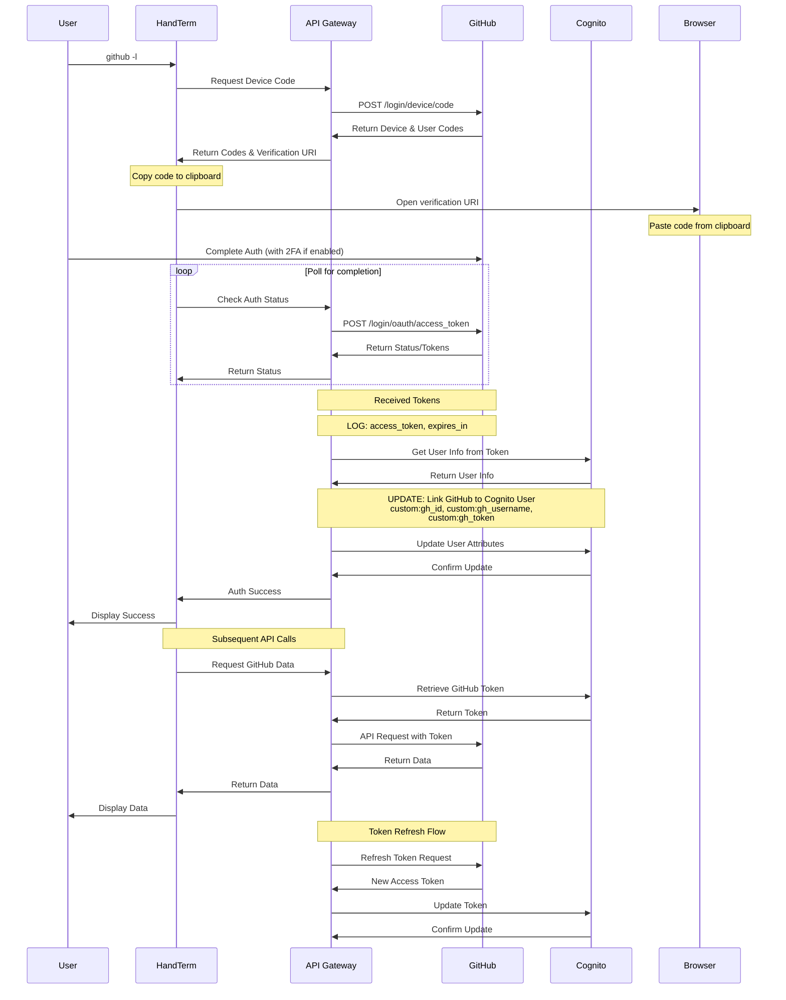

## GitHub Device Flow Authentication

This document describes the Device Flow for linking GitHub accounts to existing Cognito users in HandTerm.



### Flow Description

1. User initiates GitHub authorization with `github -l`
2. HandTerm requests a device code from GitHub
3. GitHub returns:
   - device_code: Used for polling
   - user_code: Code for user to enter
   - verification_uri: URL for authentication
4. HandTerm:
   - Opens browser to verification_uri
   - Copies user_code to clipboard
   - Begins polling for completion
5. User completes authentication in browser:
   - Pastes code (already in clipboard)
   - Completes 2FA/Passkey if enabled
6. Upon success:
   - GitHub provides access token
   - API Gateway updates Cognito user attributes:
     - custom:gh_id: GitHub user ID
     - custom:gh_username: GitHub username
     - custom:gh_token: GitHub access token

### Security Considerations

- Device Flow is designed for CLI applications
- Supports 2FA and modern authentication methods
- No need to store sensitive state parameters
- All tokens are stored in Cognito user attributes
- HandTerm stores only the Cognito tokens, not GitHub tokens

### Token Management

- GitHub tokens are stored in Cognito user attributes
- Tokens are refreshed automatically when expired
- Token updates are synchronized between GitHub and Cognito

### User Experience

```bash
$ github -l
Opening browser for GitHub authentication...
Device code copied to clipboard!
Waiting for authentication...
Successfully linked GitHub account!
```

The user experience is streamlined:
1. Single command to initiate
2. Browser opens automatically
3. Code is pre-copied to clipboard
4. Clear status updates in terminal
5. Works with any authentication method
