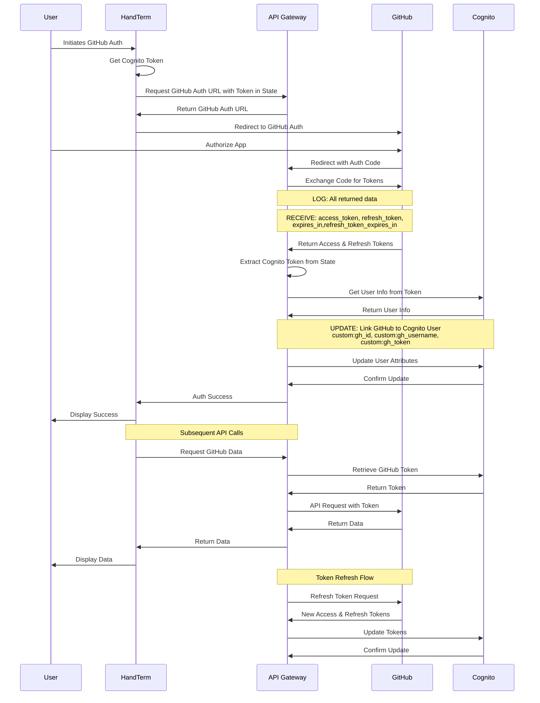

## GitHub OAuth Flow

This document describes the OAuth flow for linking GitHub accounts to existing Cognito users in HandTerm.

### Flow Description

1. User initiates GitHub authorization through the frontend
2. HandTerm includes the current user's Cognito token in the state parameter
3. User authorizes the application on GitHub
4. GitHub redirects back to our OAuth callback endpoint with an auth code
5. API Gateway exchanges the code for GitHub tokens
6. API Gateway extracts the Cognito token from state and gets user info
7. API Gateway updates the Cognito user's attributes with GitHub information:
   - custom:gh_id: GitHub user ID
   - custom:gh_username: GitHub username
   - custom:gh_token: GitHub access token

### Security Considerations

- The state parameter includes a timestamp to prevent replay attacks
- The Cognito token in state allows secure linking to the correct user
- All tokens are stored in Cognito user attributes
- HandTerm stores only the Cognito tokens, not GitHub tokens

### Token Management

- GitHub tokens are stored in Cognito user attributes
- Tokens are refreshed automatically when expired
- Token updates are synchronized between GitHub and Cognito
