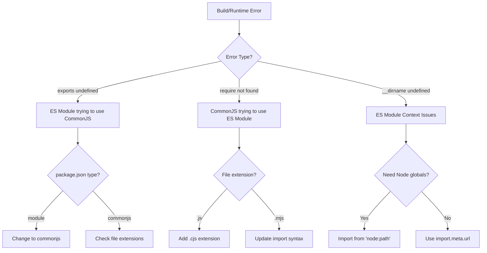

# Module System Mismatch Troubleshooting Guide

## Detection Signs

1. **Error Messages**
   - `ReferenceError: exports is not defined in ES module scope`
   - `ERR_REQUIRE_ESM`
   - `Cannot use import statement outside a module`
   - `__dirname is not defined in ES module scope`

2. **Build Warnings**
   - `The CommonJS 'exports' variable is treated as a global variable in an ECMAScript module`
   - `File is being treated as an ES module because it has a '.js' file extension`

## Quick Diagnosis

## Resolution Steps

1. **Package Configuration**
   - Check `package.json` "type" field
   - Ensure consistent module system across project
   - Use appropriate file extensions (.cjs, .mjs)

2. **TypeScript Configuration**
   - Verify `tsconfig.json` module settings
   - Check `moduleResolution` setting
   - Ensure `esModuleInterop` is enabled

3. **Build Tools**
   - Configure esbuild format (cjs/esm)
   - Set appropriate platform and target
   - Handle external dependencies correctly

4. **Code Changes**
   - Update import/export syntax
   - Replace __dirname/require with ESM equivalents
   - Use dynamic imports when needed

## Prevention

1. **Project Setup**
   - Choose module system upfront
   - Document decision in README
   - Use consistent file extensions

2. **Dependencies**
   - Check package compatibility
   - Prefer dual ESM/CommonJS packages
   - Document any special import requirements

3. **Testing**
   - Add module system tests
   - Verify builds in CI
   - Test both development and production

## Common Solutions

| Problem | Solution |
|---------|----------|
| exports undefined | Change package.json type to "commonjs" |
| require not found | Use dynamic import() |
| __dirname undefined | Use import.meta.url + fileURLToPath |
| Mixed modules | Standardize on one system |

## Lessons Learned

1. **Consistency is Key**
   - Stick to one module system
   - Use consistent import patterns
   - Maintain uniform file extensions

2. **Testing Matters**
   - Test builds early
   - Verify in multiple environments
   - Include module system tests

3. **Documentation**
   - Record module system decisions
   - Document special cases
   - Keep troubleshooting notes
